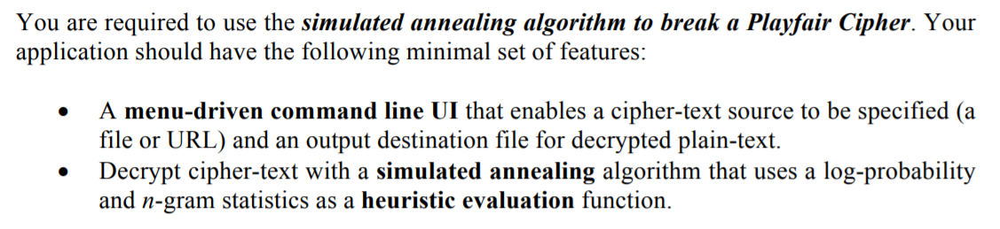
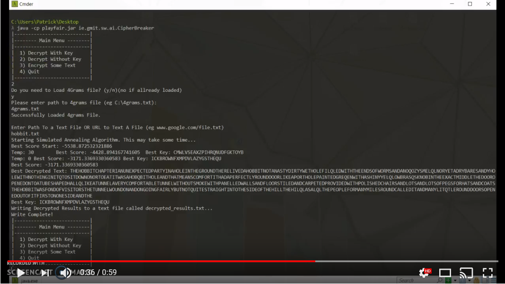
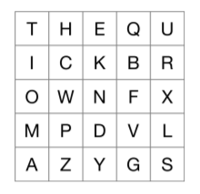
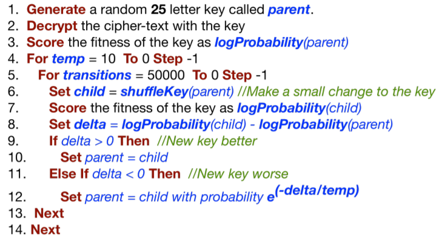
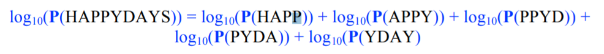

# Simulated Annealing to Break a Playfair Cipher
Fourth Year Artificial Intelligence Project

><b>Course:</b> BSc (hons) in Software Development, Year 4       
><b>Module:</b> Artificial Intelligence  
><b>Student:</b> Patrick Moran    
><b>Stident Id:</b> g00179039    
><b>Lecturer:</b> Dr John Healy    

## [Contents](#contents)
* [Introduction](#intro)
* [Playfair Cipher](#play)
* [Simulated Annealing](#sa)
* [n-Gram Statistics](#ngram)
* [Running Program](#rum)
* [References](#references)

# Introduction<a name = "intro"></a>
This repository contains my solution to Fourth Year, Artificial Intelligence project.
## Project Requirements


### Output Preview
#### Preview of the program running the Simulated Annealing Algorithm on Encrypted Text, Chapter 1 of the Hobbit.  
[](https://www.youtube.com/watch?v=CsP3g0IVtcw&feature=youtu.be&hd=1)

[Top](#contents) 

# Playfair Cipher<a name = "play"></a>


The Playfair Cipher is a manual symmetric encryption technique invented by Charles Wheatstone in 1854. It was the first Cipher in history to encrypt pairs of letters. The Playfair Cipher uses digraphs to encrypt and decrypt from a 5x5 matrix constructed from a sequence key of 25 unique letters. Because of its simplicity, needing only a pencil and paper, it was used by the British Forces in World War I and II. It was widely used to protect sensitive but non-critical messages during combat. 

[Top](#contents) 

# The Simulated Annealing Algorithm<a name="sa"></a>


There are many optimization Algorithms but for this project will be using the Simulated Annealing Algorithm. This Algorithm is a method for finding a good solution to an optimization problem. 

Simulated annealing is an excellent approach for breaking a cipher using a randomly
generated key. Simulated Annealing uses randomization to avoid heuristic plateaux and attempt to find a global maxima solution. The following algorithm is what will be used in this project to break a Playfair Cipher.

### The Algorithm


[Top](#contents) 

# n-Gram Statistics<a name="ngram"></a>
An n-gram is a substring of a word(s) of length n and can be used to
measure how similar some decrypted text is to English.  For example, the quadgrams (4-grams) of the word "HAPPYDAYS" are "HAPP", "APPY", "PPYD", "PYDA", "YDAY" and "DAYS". 

A heuristic score can be computed from the frequency of
occurrence of a 4-gram, q, as follows:  

P(q) = count(q) / n

However in this project we will use log probability because we can run into problems when multiplying probabilities with very small floating point values. The String "HAPPYDAYS" can be computed using log probabilty as follows: 



[Top](#contents) 


# Running The Program<a name = "run"></a>
1. Download or clone this repository.
2. The run the playfair Jar with the following command:

```bash
 java -cp playfair.jar ie.gmit.sw.ai.CipherBreaker
```

[Top](#contents) 

# References<a name = "references"></a>
[PlayFair Info](https://en.wikipedia.org/wiki/Playfair_cipher)   
[Adapted code for Playfair Cipher](http://rosettacode.org/wiki/Playfair_cipher#Java)    
[Create A String from a Text File](https://stackoverflow.com/q/326390)  
[Write A String to a Text File](https://stackoverflow.com/a/10390351)  
[Swapping Rows And Columns](https://stackoverflow.com/a/47020355)  
[Reverse a String](https://www.tutorialspoint.com/java/lang/stringbuilder_reverse.html)    
[Swapping Letters in Char Array](https://www.geeksforgeeks.org/swapping-characters-string-java/)    


[Top](#contents) 
